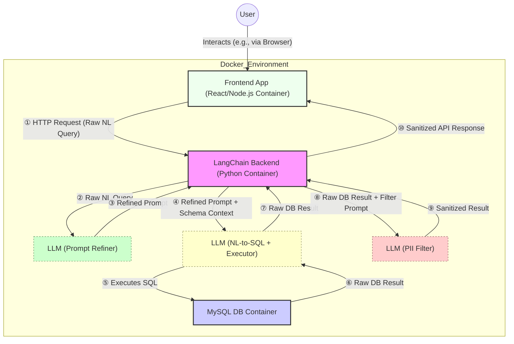
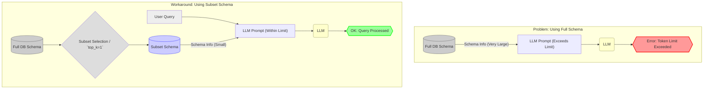
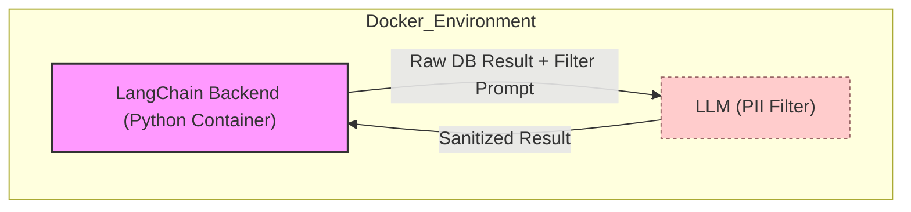

# LangChain and FastAPI Integration with MySQL

This repository demonstrates how to integrate [LangChain](https://github.com/hwchase17/langchain) with a MySQL database using a [FastAPI](https://fastapi.tiangolo.com/) backend, accompanied by a React frontend for user interaction. Everything is set up to run within Docker containers.

## Features

- **Dockerized FastAPI Backend**: Runs the FastAPI application using Docker.
- **Dockerized React Frontend**: Provides a user interface built with React, running in a Docker container.
- **LangChain Integration**: Connects to a MySQL database and interacts with it using LangChain's SQL capabilities.
- **API Endpoint**: The FastAPI backend exposes an API endpoint for the frontend to send natural language queries.
- **Schema Vectorization**: Preloads database schema into a vector database for improved query accuracy.

## Prerequisites

- [Docker](https://www.docker.com/get-started): Ensure Docker is installed and running on your system.
- [Docker Compose](https://docs.docker.com/compose/install/): Ensure Docker Compose is installed on your system.
- **MySQL Server**: A running MySQL server instance that the backend application can connect to. You will need to configure the connection details in your environment variables.
- [OpenAI API Key](https://platform.openai.com/account/api-keys): Necessary for LangChain's LLM functionalities.

## Setup Instructions

1. **Clone the Repository**:

   ```bash
   git clone [https://github.com/AmenZhou/langchain_mysql.git](https://github.com/AmenZhou/langchain_mysql.git)
   cd langchain_mysql
   ```

2. **Set Up Environment Variables**:

   Create a `.env` file in the root directory with the following content. **Make sure to configure the MySQL connection details to match your running MySQL server.**

   ```env
   OPENAI_API_KEY=your_openai_api_key_here
   DATABASE_URL=mysql+pymysql://<user>:<password>@<host>:<port>/<database>
   # Add any other backend specific environment variables here
   ```

   Replace the placeholders with your actual OpenAI API key and the connection details for your MySQL server.

3. **Build and Run Docker Containers**:

   Use Docker Compose to build and start all the application containers (backend and frontend):

   ```bash
   docker-compose up -d --build
   ```

   This command will:

   - Build the Docker images as defined in the `Dockerfile` and any frontend Dockerfile (if present).
   - Start the containers for the FastAPI backend and the React frontend, along with any other services defined in your `docker-compose.yml`.

## How to Use

1.  **Access the Frontend**: Once the Docker containers are running, the React frontend application should be accessible in your web browser. Based on the `package.json` you provided, it's likely running on port `4000`. So, navigate to `http://localhost:4000` in your browser.

2.  **Interact with the Backend**: The frontend application will provide an interface where you can enter your natural language questions. These questions will be sent to the FastAPI backend (likely running on `http://localhost:8000` if you're using the default configuration) at the `/query` endpoint.

3.  **Receive the Response**: The backend will process your query using LangChain, generate the SQL, interact with the MySQL database, and return a JSON response to the frontend. This response will typically contain the answer to your question and the generated SQL query.

4.  **Preload Schema (Optional)**: The database schema is automatically preloaded into a vector database on startup. If you want to manually preload it, you can use the following API endpoint:

    ```bash
    curl -X POST http://localhost:8000/preload_schema
    ```

    Alternatively, you can run the preload script directly:

    ```bash
    python -m backend.preload_schema --persist-dir ./chroma_db
    ```

## Schema Vectorization

This application uses a vector database to store and retrieve database schema information. This significantly improves query accuracy by providing relevant schema context to the LLM. Key benefits include:

- **Improved SQL Generation**: The LLM has access to accurate table and column information
- **Better Relationship Understanding**: Foreign key relationships are properly understood
- **Semantic Search**: Natural language queries are matched to the most relevant schema elements
- **Reduced Hallucinations**: The LLM is less likely to generate SQL with non-existent tables or columns

The schema information is automatically preloaded when the application starts.

## Additional Resources

For more information on the technologies used in this project, consider exploring the following resources:

- [LangChain Documentation](https://python.langchain.com/docs/get_started)
- [FastAPI Documentation](https://fastapi.tiangolo.com/)
- [React Documentation](https://react.dev/)
- [Docker Documentation](https://docs.docker.com/)
- [Docker Compose Documentation](https://docs.docker.com/compose/)
- [Chat With a MySQL Database Using Python and LangChain](https://alejandro-ao.com/chat-with-mysql-using-python-and-langchain/)
- [LangChain SQL Database Chain Example](https://github.com/sugarforever/LangChain-SQL-Chain)
- [LangChain Documentation on SQL Database Agents](https://python.langchain.com/docs/integrations/sql_database_agents)
  
## Diagram

### Resolve Token Rate Limit Exceeded Problem


### PHI/PII Filter LLM


## License

This project is licensed under the MIT License. See the [LICENSE](LICENSE) file for details.

---

*Note: Ensure you have the necessary permissions and have reviewed the code before running scripts, especially in a production environment.*
